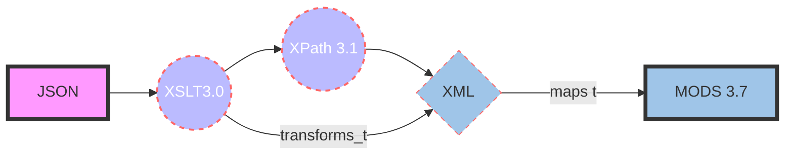

# JSON-to-MODS XSLT Transformation

**Summary:** This file contains information about transforming JSON to XML.  Once converted to XML, the metadata is mapped into the [MODS 3.7 schema](http://www.loc.gov/mods/v3).  

**Task:** Transform [Treesearch](https://www.fs.usda.gov/treesearch/) JSON files to MODS XML records for ingest into Unified Repository.

**Files**: Treesearch metadata in JSON format from the [United States Forest Service (USFS)](https://www.fs.usda.gov/).

## Transformation process

The _[json_to_mods.xsl](https://github.com/CarlosMtz3/json-to-xml/blob/master/json-to-mods.xsl)_ utilizes the following formats and schema to transform the JSON format into MODS.

-   [JSON](https://www.json.org/json-en.html): (JavaScript Object Notation)
-   [XPath 3.1](https://www.w3.org/TR/xpath-31/): (XML Path Language)
-   [XSLT 3.0](https://www.w3.org/TR/xslt-30/): (Extensible Stylesheet Language Transformations)
-   [MODS 3.7](https://www.loc.gov/standards/mods/v3/mods-3-7.xsd) : (Metadata Object Description Schema)

*Each JSON file is first transformed to XML, upon which the XML produced is mapped its respective MODS element.

## JSON to MODS Transformation Flowchart

 ###### *If the UML does not render, the image below is how the code above would render using Mermaid.

 
 ## Preparing JSON Files for XSLT Transformation

1.  Open the source_files folder
2.  Locate the following shell scripts
	-  (a) merge_json.sh 
	 - (b) data_amp_add.sh
3.  Run the merge_json.sh
4.  Run the data_amp_add.sh
5.  Open a JSON file in Oxygen
6. Verify it contains the`<data>  </data>`at the beginning of the file and at the end of the file. 

# MODS: Identifier and Location 
## MODS:Identifiers 
The primary identifiers found in the Treesearch metadata are: ***doi, product_id,***  and ***treesearch_pub_id.*** 

    {
        "product_id": "1703",
        "ac22_approved_for_public": "1",
        "primary_station": "PNW",
        "historical_station": "PNW",
        "entrystatus": "Published to Web",
        "product_type_id": "1",
        "product_type_desc": "Publication",
        "product_subtype_id": null,
        "product_subtype_desc": null,
        "referee_status_id": "2",
        "status_name": "Informally Refereed (Peer-Reviewed)",
        "pub_type_id": "5",
        "pub_type_desc": "Resource Bulletin (RB)",
        "title": "Logging residue in Washington, Oregon, California: volume and characteristics.",
        "product_year": " 1973",
        "abstract": "This report makes available data on the volume and characteristics of logging residue resulting from 1969 logging operations in Oregon, Washington, and California.   The results indicate highest volumes of logging residue are found in the Douglas-fir region of western Oregon and western Washington. Average gross volume of residue in this region ranged from 4,548 cubic feet per acre on National Forest land to 1,491 cubic feet per acre on private land; net volume averaged 3,127 and 1,328 cubic feet per acre, respectively. Total net volume for all owners in this region was estimated to be about 460 million cubic feet for 1969. The lowest average volume of logging residue was found in the ponderosa pine region of eastern Oregon and eastern Washington--gross aver aged between 350 and 400 cubic feet per acre for all owners. In California, gross volume averaged 1,905 cubic feet per acre for private lands and 1,460 cubic feet per acre for National Forests.   Additional information is provided concerning the average and total volume of residue by diameter class, length class, soundness, and type of material.",
        "citation": "Howard, James O. 1973. Logging residue in Washington, Oregon, California: volume and characteristics.  Res. Bull. PNW-RB-044. Portland, OR: U.S. Department of Agriculture, Forest Service, Pacific Northwest Research Station. 31 p",
        "keywords": "slash, logging, wood waste, Oregon, Washington, California",
        "doi": null,
        "url_binary_file": "https://www.fs.fed.us/pnw/pubs/pnw_rb044.pdf",
        "binary_filesize": "3.76 MB",
        "url_landing_page": "https://www.fs.usda.gov/treesearch/pubs/26207",
        "treesearch_pub_id": "26207",
        "pub_parent_id": null,
        "pub_child_number": null,
        "pub_parent_ind": "0",
        "pub_publication": "Res. Bull. PNW-RB-044. Portland, OR: U.S. Department of Agriculture, Forest Service, Pacific Northwest Research Station. 31 p",
        "proceedings_ind": "0",
        "pub_volume": "044",
        "pub_issue": null,
        "pub_page": null,
        "pub_page_start": null,
        "pub_page_end": null,
        "pub_source": "T",
        "geographic_terms": null,
        "issn_id": null,
        "is_early_release": "0",
        "created_on": "20-FEB-2007 12:42:05",
        "modified_on": "17-APR-2008 10:03:55",
        "send_to_reviewer_ind": "A",
        "publish_to_web_ind": "Y",
        "send_to_reviewer": null,
        "child_publications": "",
        "national_research_taxonomy_elements": 

From these **location** elements to the surrogate record and the resource itself are built to provide access. 

## MODS:location and url access[*](https://www.loc.gov/standards/mods/userguide/location.html#url)

**Definition** - Indicates the type of resource that the user will access when following the URL link.
**Application** 
(_This attribute is particularly useful to provide a flag in the context of OAI service providers harvesting metadata._)
 #### The following values may be used with the access attribute:
 - **preview** – Indicates a link to a thumbnail or snippet of text.
 - **raw object** – Indicates a direct link to the object described (e.g., a jpg or pdf document). Used only when the object is represented by a single file. 
- **object in context** – Indicates a link to the object within the context of its environment (with associated metadata, navigation, etc.)
######  Information related to url access may ben found at: https://www.loc.gov/standards/mods/userguide/location.html#url
#### 
# Issues

## ISSUE #1: Page Numbering

  - [X] Task Complete?  **Yes. Resolved.**
 ***Page numbers are not consistently correct.***	
- When the following JSON string key values are present: 
	-	pub_start_page andpub_end_page,
	-	pub_page. 
 - No issues are present with page numbers.
 - When they are not, they must be derived from the “pub_publicaton” or citation” key values. 
		- Both of these files aree strings of text, with inconsistent formatting.
	-  While they mostly do contain some pagination information
	- It is difficult to get the correct data from a string of text
------
# ISSUE #2: random "station_id" acronym

  - [X] Task Complete?  **Yes. Resolved.**
**Description:** Extraneous “station_id” acronym appearing just outside the last author name tag. 
	 -  Have not been able to determine it’s origin. 
	 -  See screenshot below
	  

# Issue  3: invalid characters usage
**Issue**: Several TreeSearch files contain an invalid characters that will render invalid when the XML processor attempts to transform them
The filenames containing the issues are listed below. Some files contain more than one issue so they are listed twice. 

 - Chacters fixed
  	- & &rarr; `&amp;`
	 - ` ` &rarr; ` `
  - Characters still needing work 
 	- `< `&rarr;` &lt;` | Needs Resolution: The "working draft" (i.e. NOT the one used in this procedure) attempts to fix file A-29760.json by changing.. 
	`..(diameter at breast height `<`6 bin) with suppressed growth...`
 	- The less than symbol `<` should be written as `&lt;` in order to be transformed by the XSLT Processor. 
 	- The shell script does not do this without changing other valid html tags (e.g.      \&lt;i>\</i>) thus rendering the rest of the JSON document invalid. 

**Resolution:** The shell script provided to add `<data></data>` tags to the beginning and end of each document, adds a second statement and has resolved 3a. With more time, issues 3b, and 3c can also be resolved. 

 The following error message is rendered:
## Issue 3a:  "&"

**Filenames:** 
 - [x] A-26207.json
 - [x] A-26377.json
 - [x] A-29788.json
 - [x] A-29790.json
 - [x] A-29793.json

**Description:** *"The entity name must immediately follow the '&' in the entity reference."*
- [x] **Task Complete?** Yes
	
 

The shell script responsible for adding `<data></data>` to the beginning and end of each file, also contains a **sed** corrects this issue
*The statement below corrects the invalid ampersand*
  
      sed -i 's/\&[^amp;|^apos;|^quot;|^lt;|^gt;]/\&amp;/gi' "

## Issue 3b: "<" usage of less-than  
**Filename:** A-29760.json 
- [ ] **Task Complete?**  No. Possible to fix shell script. 
**Description:** The content of elements must consist of well-formed character data or markup.

	- The file contains the "<" symbol within the abstract. This is treated as an invalid character and thus renders and error.

> abstract: ...(diameter at breast height <6 in) with suppressed> growth...

Once the problem is corrected manually, it produces valid MODS metadata, and a valid JSON archival replica. 
This issue can be resolved if the shell script is improved to handle preprocess this bad character prior to transformation. 

## Issue 3c: "` `"
- ` ` &rarr; ` `
- 
<!--stackedit_data:
eyJoaXN0b3J5IjpbNTY2MTQ2MTE2XX0=
-->

	

<!--stackedit_data:
eyJoaXN0b3J5IjpbLTExMTIwMjUzNjksLTY4MDQ2MjI4NCwtMj
A1ODM4NzAxMSwtMTE4NzkzNzYyOCwyMTI4NjUxMSw0NzkzNTcx
NjcsMTQ2MDA1MTA4MywxNDI1OTEwODYyLC0xMjUyMDU4MzA0LD
ExODc0MDU5MDUsMzY0MDAzOTc5LC0zMjQ4NzA3MiwxOTMzMzYz
Njg5LDEzMzE4NDExNTcsMTQwMjA0NDEwMywxNzU5ODM2NTUsOD
c1NTY2MzI1LC02ODg0OTQzOTMsLTY5MTYwMDc0NiwxMTUwMDg1
NjQ0XX0=
-->