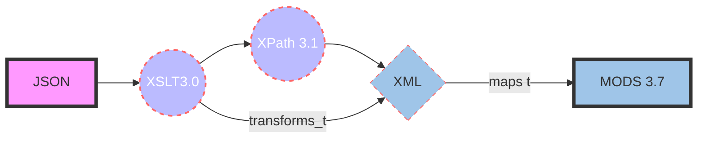

# JSON-to-MODS XSLT Transformation

**Task:** Transform [Treesearch](https://www.fs.usda.gov/treesearch/) JSON files to MODS XML records for ingest into Unified Repository.

**Materials**: Treesearch metadata in JSON format from the [United States Forest Service (USFS)](https://www.fs.usda.gov/).

## Transformation process

The _[json_to_mods.xsl](https://github.com/CarlosMtz3/json-to-xml/blob/master/json-to-mods.xsl)_ utilizes the following formats and schema to transform the JSON format into MODS.

-   [JSON](https://www.json.org/json-en.html): (JavaScript Object Notation)
-   [XPath 3.1](https://www.w3.org/TR/xpath-31/): (XML Path Language)
-   [XSLT 3.0](https://www.w3.org/TR/xslt-30/): (Extensible Stylesheet Language Transformations)
-   [MODS 3.7](https://www.loc.gov/standards/mods/v3/mods-3-7.xsd) : (Metadata Object Description Schema)

###### * Each JSON file is first transformed to XML, upon which the XML produced is mapped its respective MODS element.

flowchart LR 
id1(Start)-->id2(Stop) 
style id1 fill:#f9f,stroke:#333,stroke-width:4px 
style id2 fill:#bbf,stroke:#f66,stroke-width:2px,color:#fff,stroke-dasharray: 5 5 

# JSON-to-MODS XSLT Transformation

**Task:** Transform [Treesearch](https://www.fs.usda.gov/treesearch/) JSON files to MODS XML records for ingest into Unified Repository.

**Materials**: Treesearch metadata in JSON format from the [United States Forest Service (USFS)](https://www.fs.usda.gov/).

## Transformation process

The _[json_to_mods.xsl](https://github.com/CarlosMtz3/json-to-xml/blob/master/json-to-mods.xsl)_ utilizes the following formats and schema to transform the JSON format into MODS.

-   [JSON](https://www.json.org/json-en.html): (JavaScript Object Notation)
-   [XPath 3.1](https://www.w3.org/TR/xpath-31/): (XML Path Language)
-   [XSLT 3.0](https://www.w3.org/TR/xslt-30/): (Extensible Stylesheet Language Transformations)
-   [MODS 3.7](https://www.loc.gov/standards/mods/v3/mods-3-7.xsd) : (Metadata Object Description Schema)

*Each JSON file is first transformed to XML, upon which the XML produced is mapped its respective MODS element.

## JSON to MODS Transformation Flowchart

 ###### *If the UML does not render, the image below is how the code above would render using Mermaid.

 ## Preparing JSON Files for XSLT Transformation

1.  Open the source_files folder
2.  Locate the following shell scripts
	 (a) merge_json.sh 
	 (b) data_amp_add.sh
3.  Run the merge_json.sh
4.  Run the data_amp_add.sh
5.  Open a JSON file in Oxygen
6. Verify it contains the`<data>  </data>`at the beginning of the file and at the end of the file. 

## Create a Transformation Scenario or Select the Debugging Layout
1) Choose the json-to-mods.xsl as the transformation stylesheet. 
2) If you're creating a scenario, set the output page as desired. 
3) DO NOT set any parameters. This is taken care of by the new testing parameters added to the params-cm.xsl file. 
4) Run the scenario or choose the debugging button to transform JSON to MODS
# Usage of Identifiers
The primary identifiers found in the Treesearch metadata are: doi, product_id, and treesearch_pub_id. From these location elements to the surrogate record and the resource itself are built to provide access. 
### MODS Location tag contains information on providing url  access[*](https://www.loc.gov/standards/mods/userguide/location.html#url)

**Definition** - Indicates the type of resource that the user will access when following the URL link.
**Application** 
(_This attribute is particularly useful to provide a flag in the context of OAI service providers harvesting metadata._)
 #### The following values may be used with the access attribute:
 - **preview** – Indicates a link to a thumbnail or snippet of text.
 - **raw object** – Indicates a direct link to the object described (e.g., a jpg or pdf document). Used only when the object is represented by a single file.
- **object in context** – Indicates a link to the object within the context of its environment (with associated metadata, navigation, etc.)
######  Information related to urhttps://www.loc.gov/standards/mods/userguide/location.html#url
# Issues

## ISSUE #1: Page Numbering
Page numbers are not consistently correct.	
 - When the following JSON string key values are present: 
	-	pub_start_page and, 
	-	pub_end_page,
	-	pub_page. 
- No issues are present with page numbers.
 - When they are not, they must be derived from the “pub_publicaton” or “citation” key values. 
	- Both of these files are long strings of text, with inconsistent formatting.
	-  While they mostly do contain some pagination information
	- It is difficult to get the correct data from a string of text
------
# ISSUE #2: random "station_id" acronym
Extraneous “station_id” acronym appearing just outside the last author name tag. 
 -  Have not been able to determine it’s origin. 
 -  See screenshot below

<!--stackedit_data:
eyJoaXN0b3J5IjpbNTY2MTQ2MTE2XX0=
-->
<!--stackedit_data:
eyJoaXN0b3J5IjpbMTIzMTcxNzc0NiwtNDY3MzUwNTY3LDE3OT
czNTkzNzAsNzQzMzQ0OTMzLDE5MTE5NzU2NDVdfQ==
-->